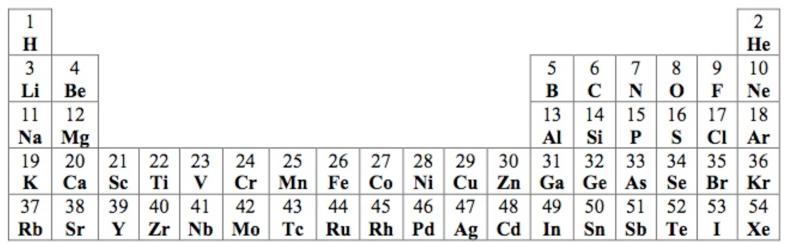

# Molecular-formula-calculator

A molecule is made of two or more atoms, where each atom can occur more than once. An atom is represented by an atomic symbol consisting of a single uppercase letter or an uppercase letter followed by a lowercase letter (e.g. H, O, Fl, Na). 

An atom also has an atomic number that represents the number of protons in that atom. For example, the chlorine atom (Cl) has an atomic number of 17, which means it has 17 protons. 



* A molecular formula is a non-empty sequence of atomic symbols (e.g. KBr, CO, LiCl). 
* A molecular formula can consist of a single atom (e.g. H) or a single atom repeated (e.g. O3)

* Part of the formula may be repeated by enclosing it in parentheses followed by an integer between 2 and 99 (e.g. Ca(OH)2). 
* The parentheses are omitted if the repeating component is a single atom (e.g. H2O, C6H12O6, Na2SO4, Ni(NO3)2). 
* It can also consist of multiple levels of parentheses (e.g. Co3(Fe(CN)6)2).

* The program will process parentheses in the formulas.
* The formula can potentially have any number of layers of parentheses.

## Testing
Testing can be done through Maven with the command:

```text
mvn test
```

To run more specific tests, run the command:
```text
mvn -Dtest=FormulaCalcTest#TESTCASEHERE test
```

where TESTCASEHERE is the test case you want to run. These test cases can be found in src/test/java/FormulaCalcTest.

For example, 
```text
mvn -Dtest=FormulaCalcTest#test_with_H test
```
runs your algorithm against the input string "H" where it expects an integer 1 as the output.

The results can be found in the command line or in target/surefire-reports/FormulaCalcTest.txt after execution.

Example input:

```txt
H
KBr
H2O
NaCl
C6H12O6
```

Example output:

```text
1
54
10
28
96
```


Example input:

```txt
Ni(NO3)2
Co3(Fe(CN)6)2
```

Example output:

```text
90
289
```


